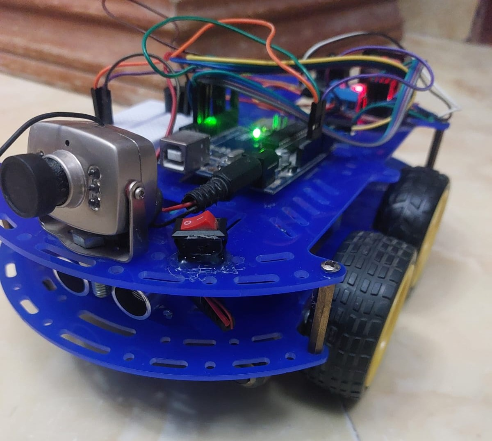
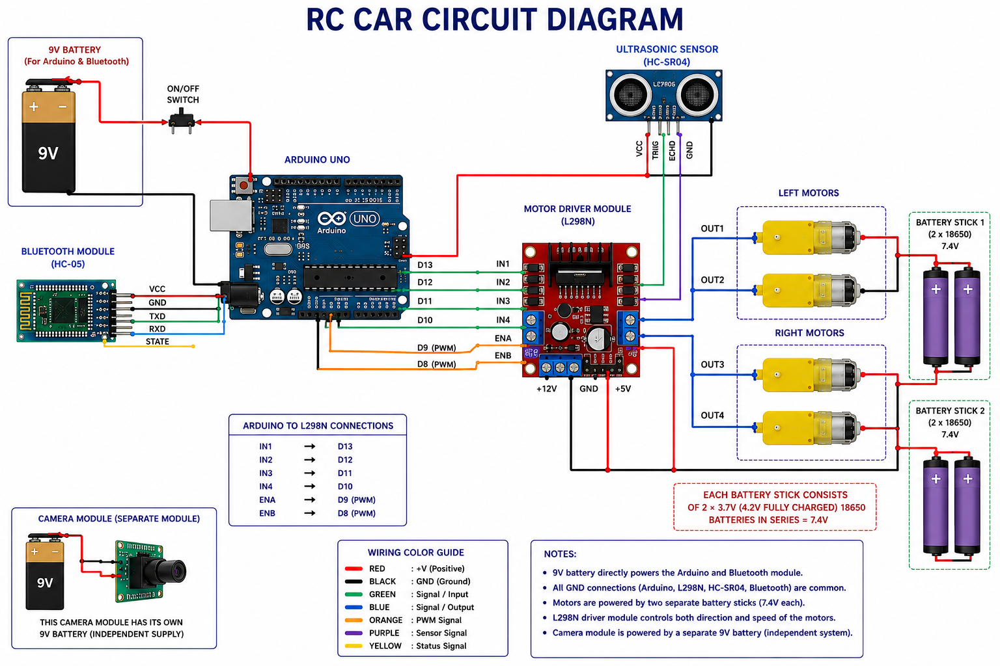

# RC Car Arduino Project

This project is a Bluetooth-controlled RC car built using Arduino UNO.  
The system allows wireless movement control and obstacle detection using an ultrasonic sensor.

---

## Features

- Forward and backward movement
- Left and right steering
- Bluetooth communication
- Obstacle detection
- Distance warning buzzer

---

## Components Used

- Arduino UNO
- HC-05 Bluetooth Module
- HC-SR04 Ultrasonic Sensor
- L298N Motor Driver
- DC Motors
- Buzzer

---

## Project Image



---

## Circuit Diagram



---

## Source Code

The Arduino source code is included in:

```text
smart_car.ino
```

---
